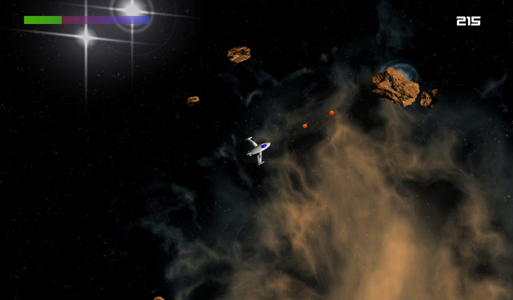

# Asteroids V1.0

© 2021 by Ben Niemann (<pink@odahoda.de>)

Download for Linux/x64: TBD

## What?

This is the oomphteenth clone of the [classic asteroids game](https://en.wikipedia.org/wiki/Asteroids_(video_game)). There is nothing special about it, so you probably don't need to care about it.

The only reason why this game was created, was to make myself familiar with the [Godot Engine](https://godotengine.org/). I chose such a boring game, so I don't get stuck endlessly in building gigantic worlds and stories or tweaking complex gameplay. I just wanted to learn how to create a game end-to-end and focus on how to get stuff done in Godot.

The graphics and sound effects have be salvaged from an older (and incomplete) game, which I created once upon a time.

The code is licensed under [GPL3](https://www.gnu.org/licenses/gpl-3.0.en.html). The assets (except for the music, see below) are [public domain](https://creativecommons.org/licenses/publicdomain/).

## Building

You should be able to open the game in Godot from a cloned repository. The game has been created with Godot 3.2.3.

If you want to rebuild the assets from their sources, you can run `make` from the `assets` directory. You will need [`povray`](https://www.povray.org/), [ImageMagick](https://imagemagick.org/)'s `convert` and [`ffmpeg`](https://www.ffmpeg.org/) in your `$PATH`.

Running `make` from the main directory builds the release binaries, though you can also do that from the editor.

## Music Credits

The music isn't my own, I just grabbed some free tracks from the [The Mod Archive](https://modarchive.org).

- [absolute xtc](https://modarchive.org/index.php?request=view_by_moduleid&query=32703) by *m0d* ([public domain](https://creativecommons.org/licenses/publicdomain/))
- [Lady Lucifer](https://modarchive.org/index.php?request=view_by_moduleid&query=32731) by *Acumen* ([CC BY-NC-ND](https://creativecommons.org/licenses/by-nc-nd/3.0/))
- [My Planet (Remix)](https://modarchive.org/index.php?request=view_by_moduleid&query=32736) by *Acumen* ([CC BY-NC-ND](https://creativecommons.org/licenses/by-nc-nd/3.0/))
- [Aryx Remix 2012](https://modarchive.org/index.php?request=view_by_moduleid&query=172938) by *Katie Cadet* ([public domain](https://creativecommons.org/licenses/publicdomain/))
- [PinkBatsinSpace](https://modarchive.org/index.php?request=view_by_moduleid&query=168688) by *JAM* ([public domain](https://creativecommons.org/licenses/publicdomain/))
- [The Digital Dragon](https://modarchive.org/index.php?request=view_by_moduleid&query=174511) by *Drozerix* ([public domain](https://creativecommons.org/licenses/publicdomain/))
